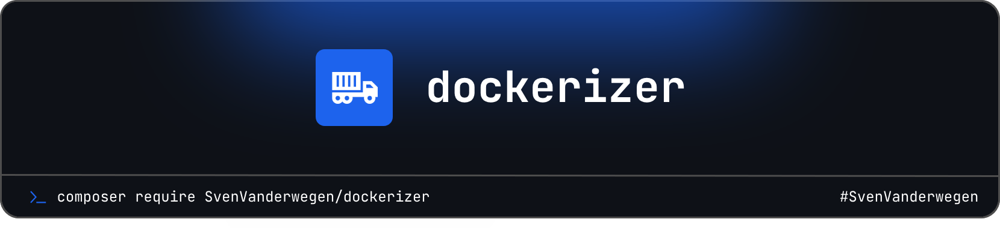

  
# Dockerizer

    
    
    
    

------
**Dockerizer** is a command line tool that helps you create Docker images for your PHP applications. It generates a `Dockerfile` and a `docker-compose.yml` file based on your application's configuration.

---

## Features & Functionality

Dockerizer provides a streamlined workflow to containerize your PHP application with minimal effort. The core functionality is exposed through two main Artisan commands:

### 1. `dockerizer:setup`
- Launches an interactive setup wizard.
- Prompts you to select:
  - Container registry (Docker Hub, GitHub, custom, etc.)
  - Repository path and (if custom) registry URL
  - Database type (MySQL, PostgreSQL, SQLite)
  - Optional services: Redis, queue worker, scheduler
- Saves your choices to `.dockerizer/config.json`.

### 2. `dockerizer:build`
- Generates all required Docker files for your application based on the configuration.
- Creates:
  - Dockerfile(s) and service stubs
  - `docker-compose.yml` with all enabled services (app, nginx, database, redis, worker, scheduler, etc.)
  - Necessary directories and GitHub Actions workflow files
- Supports a `--force` option to overwrite existing files

### Modular Service Classes
- Each Docker service (App, Nginx, Database, Redis, Worker, Scheduler) is encapsulated in its own class.
- Only services enabled in your configuration are included in the generated compose file.
- Easily extendable for additional services.

---

> **Requires [PHP 8.3+](https://php.net/releases/)**

**Dockerizer** was created by **[Sven Vanderwegen](https://github.com/SvenVanderwegen)** under the **[MIT license](https://opensource.org/licenses/MIT)**.
