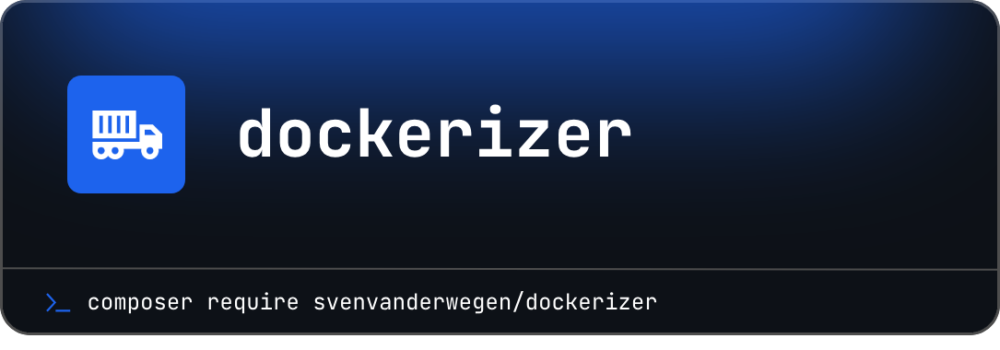

  
# Dockerizer

    
    
    
    

------
This package provides a wonderful **PHP Skeleton** to start building your next package idea.

> **Requires [PHP 8.3+](https://php.net/releases/)**

**Dockerizer** was created by **[Sven Vanderwegen](https://github.com/SvenVanderwegen)** under the **[MIT license](https://opensource.org/licenses/MIT)**.
